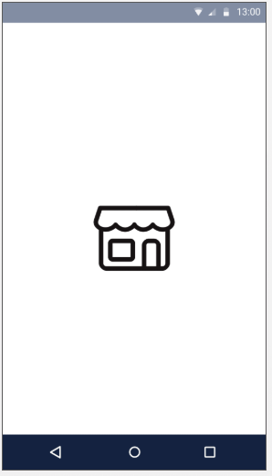
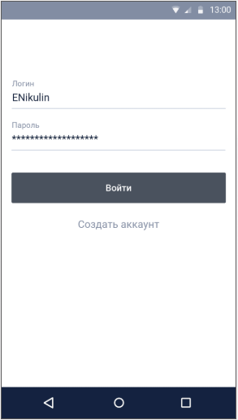
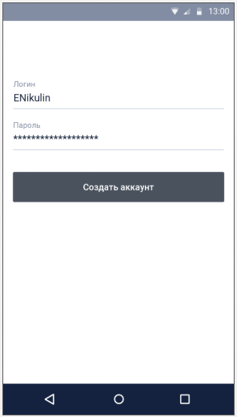
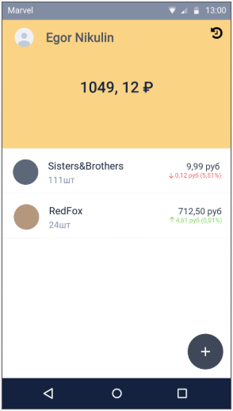
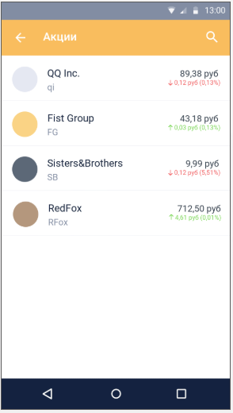
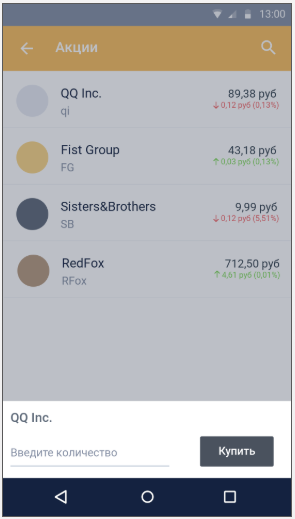
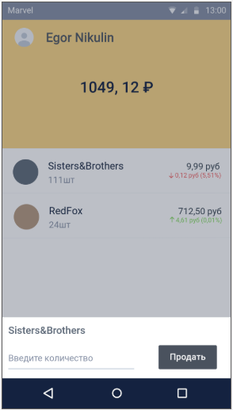
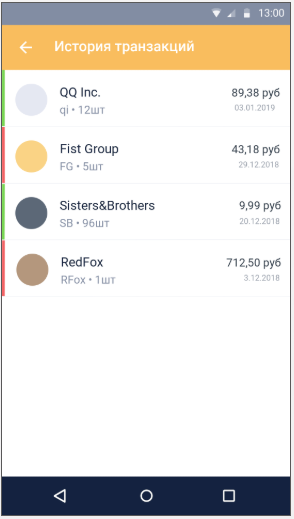

# Приложение “Магазин акций”

Приложение является клиентом для биржи, на которой осуществляется торговля акциями. Пользователь может зарегистрироваться и торговать акциями. Вход в приложение осуществляется по логину/паролю, указанным при регистрации. К аккаунту пользователя привязан денежный баланс и портфель приобретенных акций.

#### Общие требования:

- Данная работа является проверкой всех знаний, полученных на курсе.
- Рекомендуется выбирать средства/подходы/инструменты, о которых говорилось на занятиях/в домашних работах. Использование других средств не запрещено, однако их следует выбирать исходя из здравого смысла и не злоупотреблять ими. (Например, если нужно показать диалог, лучше пользоваться средствами, предоставленными Android Sdk/Support Library, а не тащить какую-то библиотеку с навороченными диалогами.)
- Прежде всего оценивается работоспособность (реализация всех функций, описанных в ТЗ) и качество кода (архитектура, читаемость, организация кода) приложения. Далее по приоритету - UI/анимация.
- Поощряется стандартный подход к дизайну: material design. Это сэкономит время т.к. многие компоненты material design реализованы в support библиотеках, а иконки для большинства случаев можно импортировать прямо в AndroidStudio
- Моменты не оговоренные в ТЗ могут быть реализованы по своему усмотрению

#### Особо стоит обратить внимание на:

- **Ресурсы**: все строки, используемые в нескольких местах размеры, цвета, и т.п. должны находиться в ресурсах
- **Дублирование кода** (в том числе и в xml-ках с версткой): оно должно быть сведено к минимуму, если вы копируете кусок кода в другое место - это повод задуматься о выносе в переиспользуемый код. В java у вас есть интерфейсы, классы, композиция и декорирование (наследование старайтесь не использовать). А для xml можно использовать include, чтобы переиспользовать уже имеющийся layout.
- **Большие классы**: старайтесь не раздувать класс до 300+ строк кода, их становиться сложно читать, и скорее всего в этом случае он делает слишком много вещей (single responsibility и все такое).
- **Комментарии**: вместо многочисленных комментариев, старайтесь разбивать код на классы методы с осмысленным именованием, чаще всего это может заменить комментарий. Это избавит вас от надобности поддерживать комментарии в актуальном состоянии при изменении/рефакторинге кода.
- **Следите за утечками**: можно периодически (например после каждого реализованного экрана) включать leak canary и пройтись по экранам.

**Общий мокап приложения**: https://marvelapp.com/g63049j/screen/52613421

**Swagger API**: https://app.swaggerhub.com/apis/enp0s23/stocks/0.0.1

#### Общие компоненты:

- При выполнении запросов на сервер  нужно показывать прогресс-бар, не допускающий взаимодействия с UI на текущем экране (способ реализации - на ваше усмотрение)
- При получении ошибки с сервера, показывается диалог, если есть возможность показывается соответствующий текст ошибки, иначе текст по умолчанию (на ваше усмотрение). Если нет подключения к интернету, в диалоге с ошибкой должен быть соответствующий текст.
- Авторизация
  - На сервере используется “Bearer Authentication”. Для того, чтобы ваш запрос проходил проверку на сервере, необходимо добавлять во все авторизованные запрос заголовок с именем “Authorization” и значением “Bearer [ваш accessToken]”
  - Авторизованные запросы в swagger помечены иконкой замка справа от относительного пути запроса
  - После авторизации/регистрации с сервера придут accessToken для запросов, и refreshToken для обновления accessToken. Обновить можно методом [/api/auth/refresh](https://app.swaggerhub.com/apis/enp0s23/stocks/0.0.1#/Auth/refreshToken)
  - Если при запросе пришел код 403, значит действие accessToken истекло и его нужно обновить

## Экраны приложения

### 1. Экран Прелоадер

Назначение: 

- Стартовый экран

Функциональность:

- Если есть сохраненные авторизационные данные, то нужно перейти на экран “Портфель”, иначе перейти на экран “Вход”
- Т.к. необходимые проверки скорее всего пройдут быстро, можно сделать задержку открытия следующего экрана (1 сек.), чтобы пользователь успел увидеть логотип

Дизайн: 

- Достаточно монотонный фон и логотип. Цвет фона и логотип можно выбрать по своему усмотрению.

Mockup:

### 2. Экран Вход

Назначение: 

- Авторизация пользователя по логину/паролю

Функциональность:

- Валидация ввода: не допускается авторизация по пустым (или состоящим только из пробелов) значениям логина или пароля. Кнопка “Вход” должна быть не кликабельной, пока введенные данные не пройдут валидацию.

- В поле “пароль” должны отображаться знаки “*” при вводе пароля.

- При нажатии на “Вход” делается запрос на сервер для авторизации

  - при успешном ответе необходимо сохранить авторизационные данные в персистентное хранилище и перейти на экран “Портфель”
  - при получении ошибки, показать ошибку

- При нажатии на “Создать аккаунт” переходим на экран “Регистрация”

API: [/api/auth/signup](https://app.swaggerhub.com/apis/enp0s23/stocks/0.0.1#/Auth/signUp)

Mockup:

### 3. Экран Регистрация

Назначение: 

- Регистрация нового пользователя

Функциональность:

- Валидация ввода: не допускается регистрация с пустыми (или состоящими только из пробелов) значениями логина или пароля. Кнопка “Создать аккаунт” должна быть не кликабельной, пока введенные данные не пройдут валидацию.
- В поле “пароль” должны отображаться знаки “*” при вводе пароля.
- При нажатии на “Создать аккаунт” делается запрос на сервер для регистрации

  - при успешном ответе необходимо сохранить авторизационные данные в персистентное хранилище и перейти на экран “Портфель”
  - при получении ошибки, показать ошибку

API: [/api/auth/signin](https://app.swaggerhub.com/apis/enp0s23/stocks/0.0.1#/Auth/signIn)

Mockup: 

### 4. Экран Портфель

Назначение: 

- Отображает информацию о пользователе, баланс, список купленных акций и информацию о них

UI:

- В верхнем тулбаре отображается аватар и имя пользователя. 

  - Пока с сервера не приходит аватар, необходимо показывать картинку-заглушку на свой выбор

- В правом углу кнопка, по нажатию на которую происходит переход на экран **“История транзакций”**

- Для обновления содержимого экрана используется pull-to-refresh

- Под тулбаром отображается баланс, фон блока с балансом подберите по своему усмотрению

  - Для начала можно сделать блок баланса как можно проще (встроить в список отдельным айтемом или вообще сделать его не скроллируемым, расположив над списком)
  - **(\*)** В качестве доп задания можно сделать баланс в AppBarLayout чтобы при скролле имя пользователя скрывалось, а баланс вставал не его место в тулбаре

- Под блоком с балансом отображается список купленных акций

- В айтеме списка купленных акций отображается: 

  - иконка акции (iconUrl)
  - наименование(name)
  - кол-во (count)
  - текущая цена (price)
  - изменение цены (priceDelta). Если изменение положительное или нулевое, то окрашивается в зеленый цвет со стрелкой вверх, иначе в красный со стрелкой вниз (см. дизайн)

- Если список купленных акций пустой, нужно отображать текст “Нет купленных акций” вместо списка.

- При клике на айтем открывается диалог **“Продажа”**

- В нижнем правом углу находится кнопка “+” - в виде floating button, по клику на нее открывается экран **“Акции”**

Функциональность:

- Экран должен кэшировать данные.
- Если кэш пустой или не актуальный, то необходимо загрузить данные портфеля (см. API) и сохранить их в кэш

- Время актуальности кэша **5 мин**. Т.е. если пользователь зашел на экран, а с последней загрузки не прошло указанное время, то нужно не грузить их с сервера, показать данные и кэша.
- При обновлении содержимого, нужно загрузить данные с сервера заново в независимости от времени жизни текущего кэша.

API: [/api/account/info](https://app.swaggerhub.com/apis/enp0s23/stocks/0.0.1#/Account/getAccountInfo) (все цены приходят в рублях)

Mockup:

### 5. Экран Акции

Назначение: 

- Отображает список акций доступных для покупки
- Поиск акций по названию

UI:

- Тулбар с названием экрана и кнопкой для поиска

- Под тулбаром - список акций

- В айтеме списка акций отображается: 

  - иконка акции (iconUrl)
  - наименование(name)
  - код акции (code)
  - текущая цена (price)
  - изменение цены (priceDelta). (аналогично отображению на экране “**Портфель**”)

  

Функциональность:

- При входе на экран нужно загрузить список акций с сервера и отобразить в списке (т.к. данные нужны все время свежие, то кэш на этом экране не нужен)
- Список можно обновить по pull-to-refresh
- Т.к. список большой, то он грузится с сервера постранично (см. API), очередную страницу, нужно грузить когда юзер приближается к концу списка (например, когда до конца остается 5-10 айтемов), объем страницы можно выбрать на свое усмотрение
- По нажатию на кнопку “Поиск” открывается поле ввода поискового запроса (удобнее всего использовать SearchView из Android Sdk)
- Поиск осуществляется по введенному в поле поиска тексту. Чтобы не слать лишние запросы, не нужно искать по тексту менее 2 символов и в процессе ввода (см. оператор [debounce](http://reactivex.io/documentation/operators/debounce.html) в Rx)
- В режиме поиска список акций заполняется результатами поиска
- После закрытия поля ввода для поиска, список снова заполняется данными со всеми акциями
- По клику на айтем в списке акций открывается диалог “**Покупка**”

API: 

- [/api/stocks](https://app.swaggerhub.com/apis/enp0s23/stocks/0.0.1#/Stocks/getStocks)

  - параметр search - для поиска по тексту
  - параметр count - объем страницы
  - параметр itemId - опорная точка для загрузки очередной страницы (в него нужно подставлять nextItemId из полученной последней страницы)

Mockup: 

### 6. Диалог “Покупка”

Назначение: 

- Покупка акций

UI:

- Реализация диалога на ваше усмотрение (рекомендация: [BottomSheet](https://material.io/design/components/sheets-bottom.html#))

- В диалоге отображены

  - Название акции
  - Поле ввода кол-ва акций для покупки
  - Кнопка “купить”

- Валидация ввода. Необходимо проверять некорректные введенные данные: 0, отрицательное или пустое значение. Варианта два на ваш выбор:

  - Валидировать при нажатии на “купить” и показывать диалог с ошибкой валидации
  - Валидировать на лету, и блокировать кнопку “купить” пока не введены корректные данные.

Функциональность:

- При нажатии на “купить” отправить запрос на сервер для покупки. При успешной покупке - закрыть диалог.
- После возвращения на “Портфель” данные портфеля должны обновиться, чтоб юзер увидел приобретенные акции.

API: [/api/transaction/buy](https://app.swaggerhub.com/apis/enp0s23/stocks/0.0.1#/Transaction/buyStocks)

Mockup:

### 7. Диалог “Продажа”

Назначение: 

- Продажа акций

UI:

- Реализация диалога на ваше усмотрение (рекомендация: [BottomSheet](https://material.io/design/components/sheets-bottom.html#))

- В диалоге отображены

  - Название акции
  - Поле ввода кол-ва акций для продажи
  - Кнопка “продать”

- Валидация ввода. Необходимо проверять некорректные введенные данные: 0, отрицательное, пустое значение, значение превышающее кол-во имеющихся акций. Варианта два на ваш выбор:

  - Валидировать при нажатии на “продать” и показывать диалог с ошибкой валидации
  - Валидировать на лету, и блокировать кнопку “продать” пока не введены корректные данные.

Функциональность:

- При нажатии на “продать” отправить запрос на сервер для продажи. При успешной продаже - закрыть диалог.
- После возвращения на “Портфель” данные портфеля должны обновиться, чтоб юзер увидел актуальные данные.

API: [/api/transaction/sell](https://app.swaggerhub.com/apis/enp0s23/stocks/0.0.1#/Transaction/sellStoks)

Mockup:

### 8. Экран История транзакций

Назаначение: 

- Отображение списка транзакций пользователя

UI:

- Тулбар с названием экрана

- Ниже - список транзакций

- В айтеме списка транзакций отображается: 

  - Индикатор покупки(зеленый)/продажи(красный) (type) (см. дизайн)
  - иконка акции (iconUrl)
  - наименование(name)
  - код акции (code)
  - кол-во акций (amount)
  - сумма транзакции (totalPrice)
  - дата транзакции (date)

Функциональность:

- При входе на экран нужно загрузить список транзакций и показать в списке

API: [/api/transaction/history](https://app.swaggerhub.com/apis/enp0s23/stocks/0.0.1#/Transaction/getTransactionsHistory)

Mockup: 
