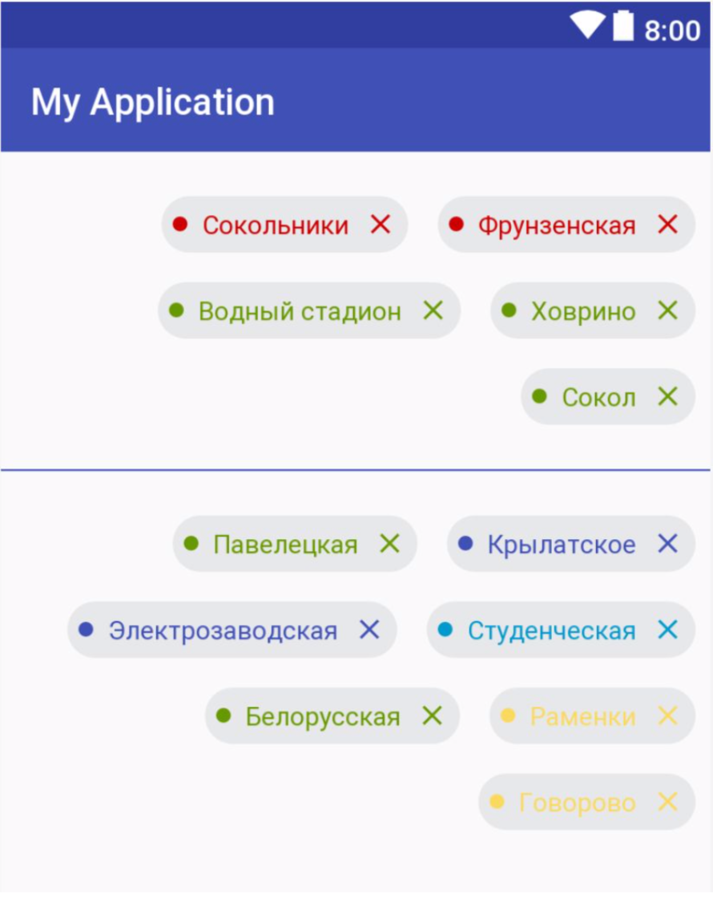

Задание №2.

Написать кастомную View Group, в которую будут добавляться вьюхи таким образом: 

- View добавляются в строку. Если длины строки не хватает на размещение view, то view переносится на следующую строчку. 
- View должны быть одинаковые по высоте, но разные по ширине
- Все view прилипают к правому краю
- По нажатию на view она удаляется из первого контейнера и появляется на последнем месте во втором и наоборот.